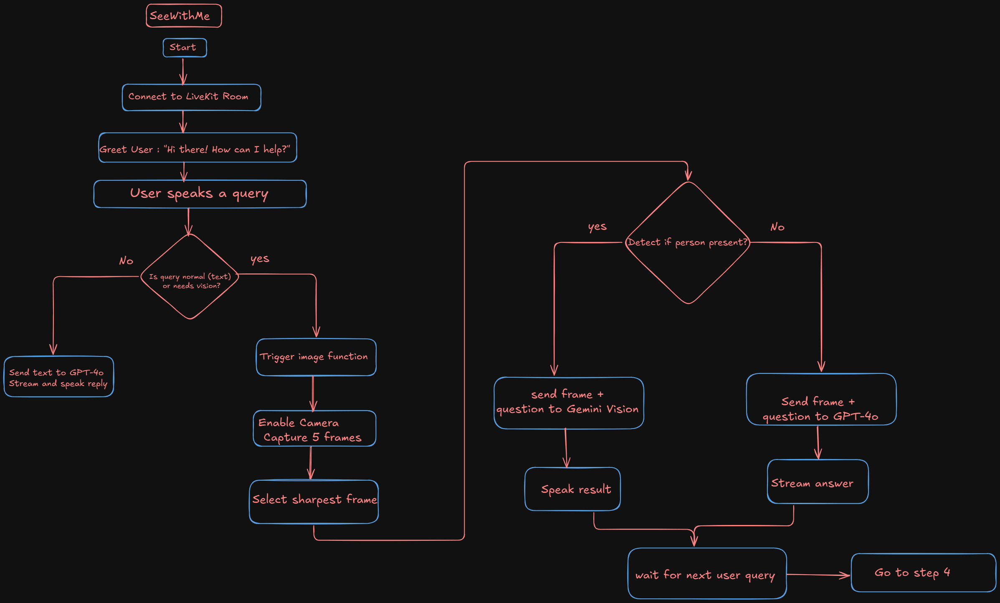

# SeeWithMe

# Project Description
Ally is an intelligent voice + vision assistant designed for the blind and visually impaired.
It listens to the user, captures camera frames only when needed, analyzes the scene, and responds quickly and naturally.

This project has two implementations:

Without Modularization → All code is inside one file.
With Modularization (Multi-Agent Design) →
    llm_agent.py: Handles pure language queries (no vision).
    vision_agent.py: Handles queries needing image understanding (YOLOv8 + Gemini).
    main.py: Dynamically switches between agents based on user needs.


# Setup

First, create a virtual environment, update pip, and install the required packages:

```
$ python3 -m venv ally_env
$ source ally_env/bin/activate
$ pip install -U pip
$ pip install -r requirements.txt
```

You need to set up the following environment variables:

```
LIVEKIT_URL=...
LIVEKIT_API_KEY=...
LIVEKIT_API_SECRET=...
DEEPGRAM_API_KEY=...
OPENAI_API_KEY=...
ELEVEN_API_KEY=...
GEMINI_API_KEY = ...
```

Then, run the assistant:

```
$ python3 assistant.py download-files
$ python3 assistant.py start

```

Finally, you can load the [hosted playground](https://agents-playground.livekit.io/) and connect it.

##  Detailed Flowchart Overview



